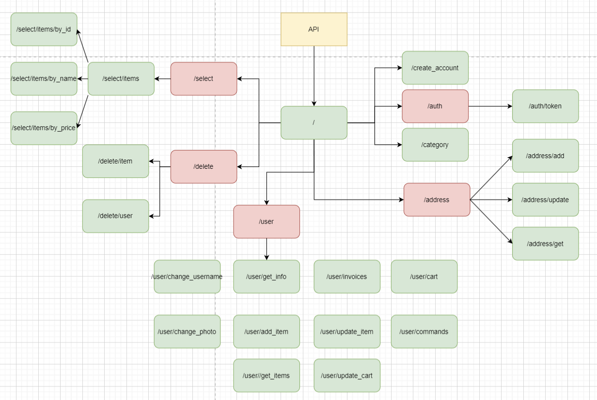

# Projet-C-sharpe-B2
Projet C# de deuxième année.

## Présentation du projet
- Bdd : SQL Server
- Back : C#
- Front : XML

## BDD
    https://github.com/albericwalsh/ecomerce.git

- username: api_user
- password: 0123

## To Do List
    - Trouver un moyen de vérifier les paramètres (parametre.Lenght)

## Archi (23 requêtes):
>En vert: rêquetes disponibles.

>En rouge: rêquetes non disponibles.
[Documentation API C.odt](Documentation%20API%20C.odt)

    - / -> page d'acceuil
    - /create_account -> créer un compte -> username, password, email
    - /auth/token -> récupération de son token d'identification -> email, password
    - /address/add -> ajouter son addresse -> Auth, street, city, cp, state, country
    - /address/get -> récupération de son addresse -> Auth
    - /address/update -> Changer les information de son addresse -> Auth, (street, city, cp, state, country)
    - /category -> récupération des catégories
    - /user/get_info -> récupération de ces info perso -> Auth
    - /user/get_items -> récupération des objets que vous vendés -> Auth
    - /user/change_username -> changer votre nom d'utilisateur -> Auth, new_name
    - /user/change_photo -> changer votre photo de profil -> Auth, new_photo
    - /user/add_item -> ajouter un produit à vendre -> Auth, name, price, description, photo, category
    - /user/update_item -> changer l'une des caractéristiques de votre produit -> Auth, item_id (name, price, description, photo, category)
    - /user/commands -> récupération de vos commandes précédedntes -> Auth
    - /user/cart -> récupération de votre panier -> Auth
    - /user/update_cart -> changer le contenue de votre panier -> Auth, item_id, option (add, delete)
    - /user/invoices -> récupération de vos facture précédentes -> Auth
    - /select/items -> récupération de tous les produits 
    - /select/items/by_id -> récupération d'un produit en fonction de leurs ID -> id
    - /select/items/by_name -> récupération d'un produit en fonction de leurs nom -> name
    - /select/items/by_price -> récupération d'un produit en fonction de leurs price -> price, option
    - /delete/user -> suppression de votre compte -> Auth
    - /delete/item -> suppression de l'un de vos produits -> Auth, item_id
    
